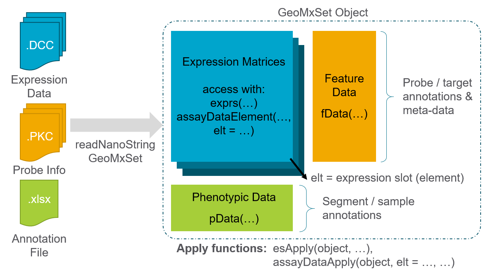

```{r style, echo = FALSE, results = 'asis'}
BiocStyle::markdown()
```

```{r setup, include = FALSE}
knitr::opts_chunk$set(
  collapse = TRUE,
  comment = "#>",
  fig.width = 5,
  fig.height = 4.5,
  dpi=200
)
```

``` {r backgroundLibraries, echo = FALSE, eval = TRUE, message = FALSE, warning = FALSE}
library(knitr)     # for kable
library(EnvStats)  # is this needed?

```

<p>
**R version**: `r R.version.string`
<br>
**Bioconductor version**: `r BiocManager::version()`
<br>
**Package**: `r packageVersion("GeomxTools")`
<\p>

# Introduction

The GeoMx Digital Spatial Profiler (DSP) is platform for capturing protein or gene expression in a spatially resolved manner [Merritt et al., 2020](https://pubmed.ncbi.nlm.nih.gov/32393914/). This vignette walks through analysis of data collected by GeoMx starting from raw count files through downstream biological analysis and interpretation.

<!--PRAJAN: this is commented - not sure if it's needed. Remove the <!--  and - -> surrounding it if you want to uncomment

GeoMx profiles expression by staining and processing standard histological slides, including fixed-frozen (FF) or formalin-fixed paraffin-embedded (FFPE) tissue sections. Tissue sections are stained with barcoded in-situ hybridization probes that bind to mRNA transcripts or oligo-labeled antibodies which bind to epitopes throughout the tissue. The slide is visualized using up to 4 immunoflorescent (IF) markers which can be IF-labeled antibodies or RNA Scope ISH probes. The user then selects regions of the interest (ROI) based on tissue morphology; if desired, each ROI can be further sub-divided into segments which will be sequentially profiled and are referred to as areas of illumination (AOI). The instrument then collects expression barcodes for each AOI individually, which are sequenced and processed. The final result are expression count files which can contain >18,000 quantified genes for every respective AOI profiled.-->

## Motivation & Scope

The intent of this vignette is to enable an analyst to work with GeoMx data and understand the workflow of a standard data analysis. This vignette will cover how to:

* Read in GeoMx count files and metadata (DCC, PKC and annotation file)
* Perform QC and normalization to prepare the data for analysis
* Perform downstream analysis and visualize the results including:
    + Dimension reduction with UMAP or t-SNE
    + Differential expression analysis with mixed effect models
    + Generate heatmaps and other visualizations of gene expression

# Getting started 

<!--SECTION commented - just put a link to install instructions???

Let's install and load `GeomxTools` package and other required packages. 

```{r installPackages, message = FALSE, warning = FALSE, eval = FALSE}
# If you have not done so, install devtools to install needed R packages
install.packages("devtools")
devtools::install_github("Nanostring-Biostats/NanoStringNCTools")
devtools::install_github("Nanostring-Biostats/GeomxTools", ref = "dev")
```
-->
If you haven't done so already, you will need to install the `GeomxTools` package. [Click here for instillation instructions and requirements](). Once you have installed the packages you can load them.

```{r libs, message = FALSE, warning = FALSE, eval = TRUE}
library(NanoStringNCTools)
library(GeomxTools)
```

For this tutorial we will use a kidney dataset profiled with human whole transcriptome atlas (WTA). The data used for this demo can be [downloaded here](http://nanostring-public-share.s3-website-us-west-2.amazonaws.com/GeoScriptHub/Kidney_Dataset_for_GeomxTools.zip) This dataset contains samples from 4 diseased kidneys and 3 healthy kidneys, with regions of interest (ROIs) placed in glomeruli and tubules, structures related to kidney function. 

## Loading the Demo Data

We will start by loading the data. The key data files are:

* DCCs files - expression count data
* PKCs file - probe metadata describing the probes present in the data
* Annotation file - useful sample information, including the type of regions profiled, and other characteristics of the samples.

The section below will look up all the files related to the project. To use a different folder, change the `file.path` to look elsewhere on your machine.

```{r quickstart, message=FALSE, warning=FALSE}
# Main folder containing the data files
datadir <- file.path("~/DA Vignettes/Kidney_Dataset_for_GeomxTools/Kidney_Dataset/")

# automatically list files in each directory for use
DCCFiles <- dir(file.path(datadir, "dccs"), pattern=".dcc$", full.names=TRUE, recursive=TRUE)
PKCFiles <- dir(file.path(datadir, "pkcs"), pattern=".pkc$", full.names=TRUE, recursive=TRUE)
SampleAnnotationFile <- dir(file.path(datadir, "annotation"), pattern=".xlsx$", full.names=TRUE, recursive=TRUE)
```

After locating your files we'll load these into a GeoMxSet using the `readNanoStringGeoMxSet` function returning a structured R object that collates this information. 

``` {r loadData, message = FALSE, warning = FALSE}
# load data
demoData <- readNanoStringGeoMxSet(dccFiles = DCCFiles,
                                   pkcFiles = PKCFiles,
                                   phenoDataFile = SampleAnnotationFile,
                                   phenoDataSheet = "Template",
                                   phenoDataDccColName = "Sample_ID",
                                   protocolDataColNames = c("aoi", "roi"),
                                   experimentDataColNames = c("panel", 
                                                              "instrument_type"))
```

<!--Seven tissue slides were analyzed, 4 diabetic kidney disease (DKD) and 3 healthy kidney. Regions of Interest (ROI) focused on two different kidney structures: tubules or glomeruli. Individual glomeruli were identified by a pathologist as either behaving relatively healthy or diseased regardless on if the tissue was DKD or healthy. One glomerulus ROI contains the entirety of a glomerulus. Tubule ROIs were segmented into distal (PanCK+) and proximal (PanCK-) tubule areas of interest (AOI). While both distal and proximal tubules are called tubules, they perform very different functions in the kidney.-->
## GeoMxSet Object Overview

The `demoData` object is stored now as a *GeoMxSet Object*. A `GeoMxSet` Object are based on `ExpressionSet` objects, and have many similar functions as those described [on Bioconductor](https://www.bioconductor.org/packages/release/bioc/vignettes/Biobase/inst/doc/ExpressionSetIntroduction.pdf). All of expression, annotation, and probe information is linked and stored together as shown in the image below. There are a few key ways to access the data now that we have created a GeoMxSet Object. We will use these throughout the tutorial.

<center>



</center>

As is shown above the GeoMxSet object consists of 3 or more elements.

* Expression count matrices - accessed with `exprs(object)` to return the matrix.
    + As we progress through the analysis we will add new expression matrices to expression slots, or elements (`elt`), which can be accessed with `assayDataElement(object, elt = ...)`
* Segment & Sample annotations - accessed with `pData(object)`
* Probe & Target information - accessed with `fData(object)`
* To learn more about other accessory functions type: `?GeomxTools::sData`

Both eSets and GeoMxSets use `esApply` to extend the [`apply`](https://www.rdocumentation.org/packages/base/versions/3.6.2/topics/apply) function to such objects. In addition to the `esApply` function defined by the `ExpressionSet` class, we have built the `assayDataApply` function to allow you to select which expression matrix `elt` you wish to use with the `esApply` function. We will demonstrate the use of these functions below. 

# Study Design

Now that we've loaded the data, let's look at the different types of regions and samples that have been profiled in the dataset. We will use `dplyr` and `ggforce` to aggregate the dataset information into a Sankey diagram which shows the breakdown of samples and how they are a related to each other.

``` {r sampleFlow, fig.width = 10, fig.height = 8, fig.wide = TRUE, message = FALSE, warning = FALSE}
library(dplyr)
library(ggforce)

# select the annotations we want to show, use `` to surround column names with
# spaces or special symbols
count_mat <- count(pData(demoData), `slide name`, class, region, segment)
# simplify the slide names
count_mat$`slide name` <-  gsub('disease','d',
                                gsub('normal','n', count_mat$`slide name`))
# gather the data and plot in order: class, slide name, region, segment
test_gr <- gather_set_data(count_mat, 1:4)
test_gr$x <- factor(test_gr$x,
                    levels = c('class','slide name','region','segment'))
# plot Sankey
ggplot(test_gr, aes(x, id = id, split = y, value = n)) +
  geom_parallel_sets(aes(fill = region), alpha = 0.5, axis.width = 0.1) +
  geom_parallel_sets_axes(axis.width = 0.2) +
  geom_parallel_sets_labels(color = 'white', size = 5) +
  theme_classic(base_size = 17) + 
  theme(legend.position = 'bottom',
        axis.ticks.y = element_blank(),
        axis.line = element_blank(),
        axis.text.y = element_blank()) +
  scale_y_continuous(expand = expansion(0)) + 
  scale_x_discrete(expand = expansion(0)) +
  labs(x = '', y = '') +
  annotate(geom = 'segment', x = 4.25, xend = 4.25, y = 20, yend = 120, lwd = 2) +
  annotate(geom = 'text', x = 4.19, y = 70, angle = 90, size = 5,
           hjust = 0.5, label = '100 segments')
```

# QC & Pre-processing


The steps above encompass the standard pre-processing workflow for GeoMx data in with GeomxTools. 

Before we begin we will shift counts with 0 detection to 1 to prevent `-Inf` in downstream transformations. This uses the `shiftCountsOne` function. We'll also calculate the geometric mean of the negative controls for use in QC, by subsetting the data using `negativeControlSubset`.

``` {r shiftCounts, eval = TRUE}
# Shift counts to one
demoData <- shiftCountsOne(demoData, useDALogic = TRUE)
```

## Segment QC 

First, we will check sequencing quality and adequate tissue sampling for every segment / AOI. For each segment there are several steps along the way to generating a count matrix, each with it's own quality metric associated and recommended threshold. FASTQ files are generated and converted to DCC files, but before we aggregate DCC files we need to check the sequencing quality within the FASTQ files. We will determine if the samples pass QC based on the number of reads per sample, the percent or reads trimmed and aligned, as well as the sequencing saturation (1 - % unique reads). We will also confirm the number of nuclei & area associated with each segment. At the end of this section we will summarize the breakdown of flags observed, and total number of segments/AOIs that have been flagged for QC failures.

```{r setqcflagupdated,  eval = TRUE}
demoData <- setSegmentQCFlags(demoData, 
                              qcCutoffs = list(minSegmentReads = 1000, # Minimum number of reads
                                            #   percentTrimmed = 80,    # Minimum % of reads trimmed
                                            #   percentStitched = 80,   # Minimum % of reads stitched
                                               percentAligned = 75,    # Minimum % of reads aligned to known targets
                                               percentSaturation = 50, # Minimum sequencing saturation
                                               minNegativeCount = 2,   # Minimum negative control counts
                                               maxNTCCount = 1000,     # Maximum counts observed in NTC well
                                               minNuclei = 20,         # Minimum # of cells observed in a segment
                                               minArea = 5000))        # Minimum segment size
QCResults <- protocolData(demoData)[["QCFlags"]]
flag_columns <- colnames(QCResults)
QC_Summary <- data.frame(Pass = colSums(!QCResults[, flag_columns]),
                         Warning = colSums(QCResults[, flag_columns]))
QCResults$QCStatus <- apply(QCResults, 1L, function(x) {
  ifelse(sum(x) == 0L, "PASS", "WARNING")
})
QC_Summary['TOTAL FLAGS', ] <- c(sum(QCResults[, 'QCStatus'] == 'PASS'),
                                sum(QCResults[, 'QCStatus'] == 'WARNING'))
```

To view the distribution of these statistics we will generate a few graphs with a quick function to draw histograms of our data using `ggplot2` and collate them with `cowplots::plot_grid`.

``` {r qcflag histograms, fig.width = 10, fig.height = 20, fig.wide = TRUE, eval = TRUE, warning = FALSE, message = FALSE}
library(ggplot2)
library(cowplot)

# Graphical summaries of QC statistics plot function
QC_histogram <- function(assay_data = NULL,
                         annotation = NULL,
                         fill_by = NULL,
                         thr = NULL,
                         xlims = NULL) {
  if(is.null(xlims)) {
    xlims <- range(assay_data[, annotation])
  }
  plt <- ggplot(assay_data,
                aes_string(x = paste0('unlist(`', annotation, '`)'),
                           fill = fill_by)) +
    geom_histogram(bins = 50) +
    geom_vline(xintercept = thr, lty = 'dashed', color = 'black') +
    theme_bw() + guides(fill = 'none') +
    facet_wrap(as.formula(paste('~', fill_by)), nrow = 8) +
    xlim(xlims) +
    labs(x = annotation, y = 'AOIs, #', title = annotation)
  plt
}

plts <- list()
plts[[1]] <- QC_histogram(sData(demoData), 'Aligned (%)', 'region', 75, c(0,100))
plts[[2]] <- QC_histogram(sData(demoData), 'Stitched (%)', 'region', 75, c(0,100))
plts[[3]] <- QC_histogram(sData(demoData), 'Trimmed (%)', 'region', 75, c(0,100))
plts[[4]] <- QC_histogram(sData(demoData), 'Saturated (%)', 'region', 50, c(0,100))
plts[[5]] <- QC_histogram(sData(demoData), 'NegGeoMean', 'region', 2) +
  scale_x_continuous(trans = 'log10')
plts[[6]] <- QC_histogram(sData(demoData), 'area', 'region', 5000) +
  scale_x_continuous(trans = 'log10')
plts[[7]] <- QC_histogram(sData(demoData), 'nuclei', 'region', 20)
plot_grid(plotlist = plts[1:7], ncol = 2)
# show all NTC values sorted from highest to lowest:
sort(unique(sData(demoData)$NTC))
```


```{r QCSummaryTable, echo = FALSE, results = 'asis'}
kable(QC_Summary, caption = 'QC Summary Table for each Segment')
```

In this particular dataset a large QC flag is found from the NTC being high in one sequencing plate. Generally in this situation we would recommend excluding the sequencing plate until it can be confirmed that there was no evidence of contamination across the FASTQ files, or resequencing can be performed. In this case we will exclude the samples, but we could also include those samples specifically by raising the QC flag threshold to a higher value by setting `maxNTCCount = 10000` in `setSegmentQCFlags`.

###  Exclude samples that did not pass Sequencing QC

```{r removeQCSampleProbe, eval = TRUE}
demoData <- demoData[, QCResults$QCStatus == 'PASS']

# Subsetting our dataset has removed samples which did not pass QC
dim(demoData)
```

Let's re-plot the Sankey diagram showing our current working dataset. 

``` {r replotSankey, fig.width = 10, fig.height = 8, fig.wide = TRUE, message = FALSE, warning = FALSE}
# select the annotations we want to show, use `` to surround column names with
# spaces or special symbols
count_mat <- count(pData(demoData), `slide name`, class, region, segment)
# simplify the slide names
count_mat$`slide name` <-  gsub('disease','d',
                                gsub('normal','n', count_mat$`slide name`))
# gather the data and plot in order: class, slide name, region, segment
test_gr <- gather_set_data(count_mat, 1:4)
test_gr$x <- factor(test_gr$x,
                    levels = c('class','slide name','region','segment'))
# plot Sankey
ggplot(test_gr, aes(x, id = id, split = y, value = n)) +
  geom_parallel_sets(aes(fill = region), alpha = 0.5, axis.width = 0.1) +
  geom_parallel_sets_axes(axis.width = 0.2) +
  geom_parallel_sets_labels(color = 'white', size = 5) +
  theme_classic(base_size = 17) + 
  theme(legend.position = 'bottom',
        axis.ticks.y = element_blank(),
        axis.line = element_blank(),
        axis.text.y = element_blank()) +
  scale_y_continuous(expand = expansion(0)) + 
  scale_x_discrete(expand = expansion(0)) +
  labs(x = '', y = '') +
  annotate(geom = 'segment', x = 4.25, xend = 4.25, y = 20, yend = 120, lwd = 2) +
  annotate(geom = 'text', x = 4.19, y = 70, angle = 90, size = 5,
           hjust = 0.5, label = '100 segments')
```

## Probe QC

In some GeoMx assays we rely on multiple probes per target to represent expression of a given gene. Across all NGS read-out assays, there are multiple probes representing our negative controls, which should not bind to any sequence in the genome. Before we summarize our data into a count matrix, we will remove probes for which we observe expression that appears spurious. This process is called outlier removal, which is performed on either a per gene (global) or per gene per AOI (local) basis. This process is only performed for targets where there are multiple ISH probes related to that target, so for our example data it will only be performed on the negative control probes. This process will always leave at least one probe representing the gene or biological target class in the dataset after the process.

### Set Probe QC Flags

[text describing defaults & rationale]

```{r setbioprobeqcflag,  eval = TRUE}
# Generally keep the qcCutoffs parameters unchanged. Set removeLocalOutliers to 
# FALSE if you do not want to remove local outliers
demoData <- setBioProbeQCFlags(demoData, 
                               qcCutoffs=list(minProbeRatio=0.1,
                                              percentFailGrubbs=20), 
                               removeLocalOutliers=TRUE)

ProbeQCResults <- fData(demoData)[["QCFlags"]]

# Define QC table for Probe QC
qc_df <- data.frame(Passed = sum(rowSums(ProbeQCResults[, -1]) == 0),
                    Global = sum(ProbeQCResults$GlobalGrubbsOutlier),
                    Local = sum(rowSums(ProbeQCResults[, -2:-1])>0))
```

```{r bioprobeQCTable, echo = FALSE, results = 'asis'}
kable(qc_df, caption = 'Probes flagged or passed as outliers')

```

### Exclude Outlier Probes

```{r excludeOutlierProbes}  
#Subset object to exclude all that did not pass Ratio & Global testing
ProbeQCPassed <- 
  subset(demoData, 
         fData(demoData)[["QCFlags"]][,c("LowProbeRatio")] == FALSE &
           fData(demoData)[["QCFlags"]][,c("GlobalGrubbsOutlier")] == FALSE)
dim(ProbeQCPassed)
demoData <- ProbeQCPassed 
```

## Limit of Quantification

In addition to outlier detection, we must now determine the limit of quantification. This is calculated based on the distribution of negative control probes, and is intended to represent the quantifiable limit of gene expression per segment, under which gene expression is no longer reliable. Please note that this process is more stable in larger segments, and AOIs with low area, and subsequently low negative control probe distributions, the LOQ may not be accurately reflective of true signal detection rates. The formula for calculating the LOQ in the $i^{th}$ segment/AOI is: 

$$LOQ_{i} = geomean(NegProbe_{i}) * geoSD(NegProbe_{i})^{n}$$

In the example below we use 2 geometric standard deviations ($n = 2$) above the geometric mean as the cutoff, which is recommended for most use cases. We also recommend that a minimum LOQ of 2 be used even if the LOQ calculated to be below this threshold.

``` {r calculateLOQ, eval = TRUE}
# Create a function to define and calculate the LOQ:
calc_LOQ <- function(object = NULL,
                     cutoff = 2,
                     minLOQ = 2) {
  negativeObject <- negativeControlSubset(object)
       # to fix known bug for multiple panels:
       # esBy(negativeObject, GROUP = "Module", 
       #      function(x) {assayDataApply(x, MARGIN = 2, elt = "exprs",
       #                             FUN = function(y) {pmax(ngeoMean(y) * ngeoSD(y) ^ cutoff, minLOQ)})})
  esApply(negativeObject, MARGIN=2, FUN=function(x) {
    pmax(ngeoMean(x) * ngeoSD(x) ^ cutoff, minLOQ)})
}

pData(demoData)$LOQ <- calc_LOQ(demoData)
```

## Create Gene-level Count Data

After calculating the LOQ we will generate a target count matrix. This will summarize all multi-probe targets into a single value represented as the geometric mean of those probes.

```{r aggregateCounts, eval = TRUE}
# Check how many unique targets the object has
length(unique(featureData(demoData)[["TargetName"]]))

# collapse to targets
target_demoData <- aggregateCounts(demoData)
dim(target_demoData)
exprs(target_demoData)[1:5, 1:2]

```

## Gene Filtering

After filtering segments with QC flags, we recommend removing genes which were poorly detected. This helps improve performance during downstream statistical tests, decreases multiple testing penalties, and may prevent interpreting stochastic expression of genes near the LOQ as biological signal.

First we will determine the number of genes detected at various cutoffs across our dataset. For each gene will will determine how many segments have expression > LOQ, and plot this information to help select a cut-point for minimal detection. We will also show you how to examine the detection rates of genes of interest, saved here as a list of gene symbols.

```{r geneDetectionRate, eval = TRUE}
pData(target_demoData)$LOQ <- pData(demoData)$LOQ
loq_test <- function(x) {x > LOQ}
LOQ_Mat <- t(esApply(target_demoData, MARGIN=1, FUN=loq_test))

# Save detection rate information to pheno & feature data
pData(target_demoData)$GenesDetected <- colSums(LOQ_Mat, na.rm = TRUE)
fData(target_demoData)$DetectedSegments <- rowSums(LOQ_Mat, na.rm = TRUE)
fData(target_demoData)$DetectionRate <-
  fData(target_demoData)$DetectedSegments / nrow(pData(target_demoData))

# Gene of interest detection table
goi <- c('PDCD1','CD274','IFNG','CD8A','CD68','EPCAM',
         'KRT18','NPHS1','NPHS2','CALB1','CLDN8')
goi_df <- data.frame(
  Gene = goi,
  NumberAOIs = fData(target_demoData)[goi, 'DetectedSegments'],
  DetectionRate = round(fData(target_demoData)[goi, 'DetectionRate']*100, 1))
```

```{r tableGOI, echo = FALSE, results = 'asis'}
kable(goi_df, caption = 'Detection rate for Genes of Interest', align = 'c')
```

Next we'll graph the detection rate across different frequencies of segments. After this step we'll decide how many genes to filter out of the dataset ahead of normalization. We recommend filtering low-expressing targets which are poorly detected as they make the upper quartile less stable, and impact false-discovery adjuments that will be run on downstream analyses.

```{r plotDetectionRate, eval = TRUE}
# Plot detection rate:
plot_detect <- data.frame(Freq = c(1, 5, 10, 20, 30, 50))
plot_detect$Number <-
  unlist(lapply(c(0.01, 0.05, 0.1, 0.2, 0.3, 0.5),
                function(x) {sum(fData(target_demoData)$DetectionRate >= x)}))
plot_detect$Rate <- plot_detect$Number / nrow(fData(target_demoData))
rownames(plot_detect) <- plot_detect$Freq

ggplot(plot_detect, aes(x = as.factor(Freq), y = Rate, fill = Rate)) +
    geom_bar(stat = 'identity') +
    geom_text(aes(label = formatC(Number, format = 'd', big.mark = ',')),
              vjust=1.6, color = 'black', size = 4) +
    scale_fill_gradient2(low = 'orange2', mid = 'lightblue',
                         high = 'dodgerblue3', midpoint = 0.65,
                         limits = c(0,1),
                         labels = scales::percent) +
    theme_bw() +
    scale_y_continuous(labels = scales::percent, limits = c(0,1),
                       expand = expansion(mult = c(0, 0))) +
    labs(x = '% of Segments',
         y = 'Genes Detected, % of Panel > LOQ')
```

Most of the target genes of interest are detected at > 10% of AOIs, and filtering to this thershold removes about half of the data. If we knew that a key feature was represented in only a small number of AOIs, or if many of our target genes was detected in < 10% of AOIs we might select a different cutoff. Additionally, target genes can be kept for downstream use by manually selecting them for inclusion in the object. We also generally recommend saving the negative control probes which we will identify using the `negativeObject` we created during LOQ calculation with `negativeControlSubset`.

``` {r subsetGenes, eval = TRUE}
# Subset to target genes detected in at least 10% of the samples.
#   Also manually include the negative control probe, for downstream use
negativeObject <- negativeControlSubset(demoData)
neg_probes <- unique(fData(negativeObject)$TargetName)
target_demoData <- 
  target_demoData[fData(target_demoData)$DetectionRate > 0.1 |
                    fData(target_demoData)$TargetName %in% neg_probes, ]
dim(target_demoData)

# remove genes we filtered out from goi list
goi <- goi[goi %in% rownames(target_demoData@assayData$exprs)]
```

# Normalization

We will now normalize the GeoMx data for downstream visualizations and differential expression. Two common methods for normalization are i) upper quartile (Q3) or ii) background normalization.

Both of these normalization methods rely on the distribution of the data to estimate a normalization factor to roughly bring the data distributions together. More advanced methods for normalization and modelings are under active development, however, for most projects these methods are sufficient for understanding differences between biological classes of segments and samples. Additionally other packages such as `limma` may also be appropriate in some cases.

Before normalization, we will explore the relationship between the upper quartile (Q3) of the counts in each segment with the geometric mean of the negative control probes in the data. We'd ideally like there to be separation between these two values before normalizing to one of them. If you do not see sufficient separation between these values, you may need to be more aggressive with filtering out low-expressing genes.

For additional guidance, please refer to our [Data Analysis White Paper for DSP-NGS Assays](https://www.nanostring.com/resources/geomx-cta-data-whitepaper/)

``` {r, previewNF, fig.width = 8, fig.height = 8, fig.wide = TRUE, eval = TRUE}
library(reshape2)  # for melt
# Graph Q3 value vs negGeoMean of Negatives
ann_of_interest <- 'region'
Stat_data <- 
  data.frame(row.names = colnames(exprs(target_demoData)),
             AOI = colnames(exprs(target_demoData)),
             Annotation = pData(target_demoData)[, ann_of_interest],
             Q3 = unlist(apply(exprs(target_demoData), 2,
                               quantile, 0.75, na.rm = TRUE)),
             NegProbe = exprs(target_demoData)[neg_probes, ])
Stat_data_m <- melt(Stat_data, measure.vars = c('Q3','NegProbe'),
                    variable.name = 'Statistic', value.name = 'Value')

plt1 <- ggplot(Stat_data_m,
               aes(x = Value, fill = Statistic)) +
  geom_histogram(bins = 40) + theme_bw() +
  scale_x_continuous(trans = 'log2') +
  facet_wrap(~Annotation, nrow = 1) + 
  scale_fill_brewer(palette = 3, type = 'qual') +
  labs(x = 'Counts', y = 'AOIs, #')

plt2 <- ggplot(Stat_data,
               aes(x = NegProbe, y = Q3, color = Annotation)) +
  geom_abline(intercept = 0, slope = 1, lty = 'dashed', color = 'darkgray') +
  geom_point() + guides(color = 'none') + theme_bw() +
  scale_x_continuous(trans = 'log2') + 
  scale_y_continuous(trans = 'log2') +
  theme(aspect.ratio = 1) +
  labs(x = 'Negative Probe GeoMean, Counts', y = 'Q3 Value, Counts')

plt3 <- ggplot(Stat_data,
               aes(x = NegProbe, y = Q3/NegProbe, color = Annotation)) +
  geom_hline(yintercept = 1, lty = 'dashed', color = 'darkgray') +
  geom_point() + theme_bw() +
  scale_x_continuous(trans = 'log2') + 
  scale_y_continuous(trans = 'log2') +
  theme(aspect.ratio = 1) +
  labs(x = 'Negative Probe GeoMean, Counts', y = 'Q3/NegProbe Value, Counts')

btm_row <- plot_grid(plt2, plt3, nrow = 1, labels = c('B',''),
                     rel_widths = c(0.45,0.55))
plot_grid(plt1, btm_row, ncol = 1, labels = c('A',''))
```

Next we will use the `normalize` function from `NanoStringNCTools` to create normalization factors reflecting each data type. Upper quartile normalization is performed using `norm_method = "quant"` setting the `desiredQuantile` flag to 0.75. Other quantiles may be specified by changing that value. Quantile normalized data should be saved to the a specific normalized elt using `toELT = "q_norm"`.

Similarly background normalization is performed by setting `norm_method = "neg"` and `toElt = "neg_norm"`. each of these elt slots has been pre-defined and is expects consistently sized datasets as the base expression count matrix. 

```{r normalizeObject, eval = TRUE}
# Q3 norm (75th percentile) for WTA/CTA  with or without custom spike-ins
target_demoData <- normalize(target_demoData , data_type = "RNA",
                             norm_method = "quant", 
                             desiredQuantile = .75,
                             toElt = "q_norm")

# Background normalization for WTA/CTA without custom spike-in
target_demoData <- normalize(target_demoData , data_type = "RNA",
                             norm_method = "neg", 
                             fromElt = "exprs",
                             toElt = "neg_norm")
```

To demonstrate the impact of normalization we'll graph a few boxplots of the data at for the base expression values, upper quartile, and background normalization.

```{r normplot, fig.small = TRUE}
# visualize the first 10 segments with each normalization method
boxplot(exprs(target_demoData)[,1:10],
        col = '#9EDAE5', main = 'Raw Counts',
        log = 'y', names = 1:10, xlab = 'Segment',
        ylab = 'Counts, Raw')

boxplot(assayDataElement(target_demoData[,1:10], elt = 'q_norm'),
        col = '#2CA02C', main = 'Q3 Norm Counts',
        log = 'y', names = 1:10, xlab = 'Segment',
        ylab = 'Counts, Q3 Normalized')

boxplot(assayDataElement(target_demoData[,1:10], elt = 'neg_norm'),
        col = '#FF7F0E', main = 'Neg Norm Counts',
        log = 'y', names = 1:10, xlab = 'Segment',
        ylab = 'Counts, Neg. Normalized')
```

# Unsupervised Analysis

## UMAP & t-SNE

One common approach to understanding the data after normalization is to plot the data in a reduced dimensionality space. Two common methods for this are UMAP and tSNE projections, which are non-orthogonally constrained projections which can cluster samples based on overall gene expression rates. In this example we see that by either UMAP (from the `umap` package) or tSNE (from the `Rtsne` package) we see clusters of segments related to morphology and disease status (normal & diabetic kidney disease (DKD)).

``` {r dimReduction, eval = TRUE}
library(umap)
# update defaults for umap to contain a stable random_state (seed)
custom_umap <- umap::umap.defaults
custom_umap$random_state <- 42

# run UMAP
umap_out <- umap(t(log2(assayDataElement(target_demoData , elt = "q_norm"))),  
                 config = custom_umap)
pData(target_demoData)[, c('UMAP1','UMAP2')] <- umap_out$layout[, c(1,2)]
ggplot(pData(target_demoData),
       aes(x = UMAP1, y = UMAP2, color = region, shape = class)) +
  geom_point(size = 3) +
  theme_bw()

library(Rtsne)
# run tSNE
tsne_out <- Rtsne(t(log2(assayDataElement(target_demoData , elt = "q_norm"))),
                  perplexity = 5)
pData(target_demoData)[, c('tSNE1','tSNE2')] <- tsne_out$Y[, c(1,2)]
ggplot(pData(target_demoData),
       aes(x = tSNE1, y = tSNE2, color = region, shape = class)) +
  geom_point(size = 3) +
  theme_bw()
```

## Clustering high CV Genes

Another unsupervised way to explore the structure of the data is to calculate the coefficient of variation (CV), for each gene ($g$) using the formula $CV_g = SD_g/mean_g$. After calculating we can look for genes with high CVs which should have large differences across the various segments that we have profiles. This is an unbiased way of showing highly variable genes across the dataset. For visualization we use the `pheatmap` package and function, which has many granular controls on how to graph the data.

``` {r CVheatmap, eval = TRUE, fig.width = 8, fig.height = 6.5, fig.wide = TRUE}
library(pheatmap)  # for pheatmap
calc_CV <- function(x) {sd(log2(x)) / mean(log2(x))}
CV_dat <- assayDataApply(target_demoData, elt = 'q_norm', MARGIN = 1, calc_CV)
# show the highest CD genes and their CV values
sort(CV_dat, decreasing = TRUE)[1:5]

# Identify genes in the top 3rd of the CV values
GOI <- names(CV_dat)[CV_dat > quantile(CV_dat, 0.66)]
pheatmap(log2(assayDataElement(target_demoData[GOI, ], elt = 'q_norm')),
         scale = 'row', 
         show_rownames = FALSE, show_colnames = FALSE,
         border_color = NA,
         clustering_method = 'average',
         clustering_distance_rows = 'correlation',
         clustering_distance_cols = 'correlation',
         cutree_cols = 2, cutree_rows = 2,
         breaks = seq(-3, 3, 0.05),
         color = colorRampPalette(c('purple3','black','yellow2'))(120),
         annotation_col = pData(target_demoData)[, c('class','segment','region')])
```

# Differential Expression

A common method for exploring differences between groups of segments or patients is to perform differential expression analysis. While advanced methods for modeling the underlying count distribution are being actively developed, a common approach is to use a linear mixed-effect model (LMM). LMMs allow the user to account for the fact that we sample multiple times within a slide, rather than assuming that each AOI is independently sampled. We use the `lme4` and `lmerTest` packages to calculate an LMM. The structure of the LMM preferred depends on the question being investigated. 

As shown in the diagram below, for studies where you compare features within slides, we use a complex model to account for shared information shown below. For studies analyzing results between slides we can use a more simplistic model.


## Within Slide Analysis: Glomeruli vs Tubules

First we'll explore differences in morphological structures within the kidney: glomeruli and tubules. Because we are comparing structures found within the same slide we will use the structure outlined in *A* above. Region is what we want to test against, while we control for slide specific sampling using a random slope and intercept. If multiple samples are contained within a slide, we would change the random slope and intercepts to account for sample instead.

In this analysis we save log~2~ fold change estimates and P-values using `coef(summary(...))`, and use `p.adjust(..., method = 'fdr')` to apply a benjamini-hochberg multiple test correction.

``` {r cheatDE, eval = TRUE, echo = FALSE}
# below is work-around text to quick load DE results from a saved csv for convenience
# THIS SECTION WILL NOT BE SHOWN, is only for speed of iteration
results <- read.csv('~/DE_results_for_testing.csv', row.names = 1)
colnames(results) <- c('Gene','Estimate','Pr(>|t|)','FDR')

# turn eval to TRUE in next code block to re-run LMM code (will take ~15-30 minutes on a single core local machine)
```

``` {r DEComplex, eval = FALSE, warning = FALSE, message = FALSE}
library(lme4)      # for lmer
library(lmerTest)  # for p-values for lmer
# Create a factor level for testing, this ensures appropriate directionality:
#   FC < 0 is enriched in glomeruli
#   FC > 0 is enriched in tubules
pData(target_demoData)$testRegion <- 
  factor(pData(target_demoData)$region, c('glomerulus','tubule'))

# Define statistical test
lmm <- function(gene) {
  coef(summary(lmer(log2(gene) ~ testRegion + 
                      (1 + `slide name`| `slide name`))))[2, c(1,5)]
}
# Run tests
results <- t(suppressMessages(assayDataApply(target_demoData,
                                             elt = "q_norm",
                                             MARGIN = 1, lmm)))

# DE results are just stored as a table here, but could also be stored in fData
results <- cbind(data.frame(Gene = rownames(results)),
                 as.data.frame(results))
results$FDR <- p.adjust(results$`Pr(>|t|)`, method = 'fdr')
```

``` {r saveDETable, eval = FALSE, echo = FALSE}
# Save DE table (either same file read in or new calculation)
write.csv(results, '~/DE_results_for_testing.csv')
```

## Between Slide Analysis: Diabetic Kidney Disease Glomeruli vs Healthy Glomeruli

Another common use case it to look for differences between patients or sample specimens, as shown in *B* in the figure above. Below is an example of our to code an LMM looking for variation on between patients, in this example using the `class` variable which contains disease status. Before running this model we will subset the data to only compare the glomeruli between patient classes. More complex models could be used to model both structures at once are beyond the scope of this tutorial.

``` {r DEsimple, eval = FALSE}
# Create a factor level for testing, this ensures appropriate directionality:
#   FC < 0 is enriched in normal tissue
#   FC > 0 is enriched in DKD tissue
pData(target_demoData)$testClass <-
  factor(pData(target_demoData)$class, c('normal','DKD'))

# Define statistical test
lmm <- function(gene) {
  coef(summary(lmer(log2(gene) ~ testClass + (1 | `slide name`))))[2, c(1,5)]
}
# Identify the glomeruli regions
glom <- pData(target_demoData)$region == 'glomerulus'
# Run tests on only the glomeruli
results_disease <- t(suppressMessages(assayDataApply(target_demoData[glom, ], 
                                                     elt = "q_norm",
                                                     MARGIN = 1, lmm)))

# DE results are just stored as a table similar to before
results_disease <- cbind(data.frame(Gene = rownames(results_disease)),
                 as.data.frame(results_disease))
results_disease$FDR <- p.adjust(results_disease$`Pr(>|t|)`, method = 'fdr')
```

``` {r glomindex, eval = TRUE, echo = FALSE}
# since we didn't execute above, ID the glomeruli for later use
glom <- pData(target_demoData)$region == 'glomerulus'
```

## Interpreting the results table

Going back to the first test between glomeruli & tubules, the table produced captures 2 of the key features for DE. It saved the log~2~ fold change value, called `Estimate` in the table, and the P-value, called `Pr(>|t|)`. Let's take a look at our genes of interest and what their log~2~ fold change (`Estimate`), P-value (`Pr(>|t|)`), and FDR are. We can do this by simply subsetting the results table we just generated by typing `results[goi, ]`. 

``` {r DEtable, echo = FALSE, results = 'asis', }
kable(results[goi, ], digits = 3, caption = 'DE results for Genes of Interest', align = 'lc')
```

# Visualizing DE Genes

## Volcano Plots

Let's code a simple `ggplot2` graph for a volcano plot, which will color based on various cuts in the significance threshold and label genes the top 50 genes based on P-value with `ggrepel` on either side of the volcano plot. 

``` {r volcanoPlot, fig.width = 10, fig.height = 8, fig.wide = TRUE, warning = FALSE, message = FALSE}
library(ggrepel) 
# Categorize Results based on P-value & FDR for plotting
results$Color <- 'NS or FC < 0.5'
results$Color[results$P < 0.05] <- 'P < 0.05'
results$Color[results$FDR < 0.05] <- 'FDR < 0.05'
results$Color[results$FDR < 0.001] <- 'FDR < 0.001'
results$Color[abs(results$Estimate) < 0.5] <- 'NS or FC < 0.5'
results$Color <- factor(results$Color,
                        levels = c('NS or FC < 0.5', 'P < 0.05',
                                   'FDR < 0.05', 'FDR < 0.001'))

# pick top genes for either side of volcano to label
# order genes for convenience:
results$invert_P <- (-log10(results$`Pr(>|t|)`)) * sign(results$Estimate)
top_g <- c(results$Gene[order(results$invert_P, decreasing = TRUE)[1:50]],
           results$Gene[order(results$invert_P, decreasing = FALSE)[1:50]])
results <- results[, -1*ncol(results)] # remove invert_P from matrix

# Graph results
ggplot(results,
              aes(x = Estimate, y = -log10(`Pr(>|t|)`),
                  color = Color, label = Gene)) +
  geom_vline(xintercept = c(0.5, -0.5), lty = 'dashed') +
  geom_hline(yintercept = -log10(0.05), lty = 'dashed') +
  geom_point() +
  labs(x = 'Enriched in Glomeruli <- log2(FC) -> Enriched in Tubules',
       y = 'Significance, -log10(P)',
       color = 'Significance') +
  scale_color_manual(values = c(`FDR < 0.001` = 'dodgerblue',
                                `FDR < 0.05` = 'lightblue',
                                `P < 0.05` = 'orange2',
                                `NS or FC < 0.5` = 'gray')) +
  scale_y_continuous(expand = expansion(mult = c(0,0.05))) +
  geom_text_repel(data = subset(results, Gene %in% top_g),
                  size = 4, point.padding = 0.15, color = 'black',
                  min.segment.length = .1, box.padding = .2, lwd = 2) +
  theme_bw(base_size = 16)
```

## MA Plot

Another common visualization of expression would be to graph a MA plot looking for differences relative to expression within the baseline feature. As we have filtered out genes with low expression, it will not have the traditional shape of an MA plot, but can be useful in identifying targets with relatively high fold change and baseline expression. In the plot below we keep the labels the same as on the volcano plot for reference.

``` {r maPlot, fig.width = 10, fig.height = 8, fig.wide = TRUE, warning = FALSE, message = FALSE}
results$MeanExp <-
  rowMeans(assayDataElement(target_demoData,
                            elt = 'q_norm'))
ggplot(subset(results, !Gene %in% neg_probes),
       aes(x = MeanExp, y = Estimate,
           size = -log10(`Pr(>|t|)`),
           color = Color, label = Gene)) +
  geom_hline(yintercept = c(0.5, -0.5), lty = 'dashed') +
  scale_x_continuous(trans = 'log2') +
  # geom_hline(yintercept = -log10(0.05), lty = 'dashed') +
  geom_point(alpha = 0.5) + 
  labs(y = 'Enriched in Glomeruli <- log2(FC) -> Enriched in Tubules',
       x = 'Mean Expression',
       color = 'Significance') +
  scale_color_manual(values = c(`FDR < 0.001` = 'dodgerblue',
                                `FDR < 0.05` = 'lightblue',
                                `P < 0.05` = 'orange2',
                                `NS or FC < 0.5` = 'gray')) +
  geom_text_repel(data = subset(results, Gene %in% top_g),
                  size = 4, point.padding = 0.15, color = 'black',
                  min.segment.length = .1, box.padding = .2, lwd = 2) +
  theme_bw(base_size = 16)
```

Because we are exploring the relationship between expression and tissue substructure, we can leverage other databses to validate our findings. The [Human Protein Atlas](https://www.proteinatlas.org/) is a key resource for understanding protein localization. While not all markers have identified have been confirmed, as their targets may not have suitable antibodies available, in either side of the analysis we are able to find examples of top or near top hits concordant with these results:

* [PODXL Expression in Kidney Glomeruli](https://www.proteinatlas.org/ENSG00000128567-PODXL/tissue/kidney)
* [NPHS2 Expression in Kidney Glomeruli](https://www.proteinatlas.org/ENSG00000116218-NPHS2/tissue/kidney)
* [KRT8 Expression in Kidney Tubules](https://www.proteinatlas.org/ENSG00000170421-KRT8/tissue/kidney)
* [PIGR expression in Kidney Tubules](https://www.proteinatlas.org/ENSG00000162896-PIGR/tissue/kidney)
* [SPP1 expression in Kidney Tubules](https://www.proteinatlas.org/ENSG00000118785-SPP1/tissue/kidney)

In the next section we'll explore the expression of PODXL & KRT8 further to demonstrate the dynamics of these targets.

## Plotting Genes of Interest

Now that we know the top deferentially expressed genes, we can explore the expression of individual genes from the volcano plot. First we'll create a boxplot of a gene enriched within the glomeruli, PODXL (Podocalyxin-Like). Using `ggplot2` we attach the phenotypic data (`pData`) so all of those variables are available for use, and manually call the expression data using `assayDataElement(..., elt = 'q_norm')`.

In the second graph we plot two genes on opposite sides of the volcano plot against each other. While PODXL is highly enriched in the glomeruli, Keratin-8 (KRT8) should show expression very specifically in the tubules. Plotting these against each other should show a mutually exclusive expression pattern that can easily distinguish the two structures. On this graph the dashed vertical lines represent the maximum observed KRT8 expression in glomeruli and and horizontal represent the maximum observed PODXL expression in the tubules.

``` {r targetExprs, eval = TRUE}
# show expression for a single target: PODXL
ggplot(pData(target_demoData),
       aes(x = region, fill = region,
           y = assayDataElement(target_demoData['PODXL', ],
                                elt = 'q_norm'))) +
  geom_boxplot() +
  labs(y = 'PODXL Expression') +
  scale_y_continuous(trans = 'log2') +
  theme_bw()

# show expression of PODXL vs KRT8
ggplot(pData(target_demoData),
       aes(x = assayDataElement(target_demoData['KRT8', ],
                                elt = 'q_norm'),
           y = assayDataElement(target_demoData['PODXL', ],
                                elt = 'q_norm'),
           color = region, shape = class)) +
  geom_vline(xintercept =
               max(assayDataElement(target_demoData['KRT8', glom],
                                    elt = 'q_norm')),
             lty = 'dashed', col = 'darkgray') +
  geom_hline(yintercept =
               max(assayDataElement(target_demoData['PODXL', !glom],
                                    elt = 'q_norm')),
             lty = 'dashed', col = 'darkgray') +
  geom_point(size = 3) +
  theme_bw() +
  scale_x_continuous(trans = 'log2') + 
  scale_y_continuous(trans = 'log2') +
  labs(x = 'KRT8 Expression', y = 'PODXL Expression')
```

## Heatmap of Significant Genes

In addition to generating individual gene boxplots or volcano plots, we can again create a heatmap from our data. This time instead of using the CV to select genes, we simply use the P-value or FDR to select Genes. Here we show all genes with an FDR < 1e-5.

``` {r heatmap, eval = TRUE, fig.width = 8, fig.height = 6.5, fig.wide = TRUE}
# select top significant genes based on significance, plot with pheatmap
GOI <- subset(results, `FDR` < 1e-5)$Gene
pheatmap(log2(assayDataElement(target_demoData[GOI, ], elt = 'q_norm')),
         scale = 'row', 
         show_rownames = FALSE, show_colnames = FALSE,
         border_color = NA,
         clustering_method = 'average',
         clustering_distance_rows = 'correlation',
         clustering_distance_cols = 'correlation',
         cutree_cols = 2, cutree_rows = 2,
         breaks = seq(-3, 3, 0.05),
         color = colorRampPalette(c('purple3','black','yellow2'))(120),
         annotation_col = pData(target_demoData)[, c('region','class')])
```

# Additional Resources

While this vignette has focused on the full workflow of analysis we have also created vignettes that thoroughly describe the functionals and tools built into the `GeomxTools` package that more advanced users may be interested in. Please see the [Vignette name](Vignette link) *NEEDS LINK* vignette for more detailed information on all `GeomxTools` functionality.

## Links

GeoMx Background:

* [Kidney Geomx Demo Dataset](http://nanostring-public-share.s3-website-us-west-2.amazonaws.com/GeoScriptHub/Kidney_Dataset_for_GeomxTools.zip)
* [Merritt et al., 2020](https://pubmed.ncbi.nlm.nih.gov/32393914/) - Manuscript describing GeoMx Workflow and technology
* [Data Analysis White Paper for DSP-NGS Assays](https://www.nanostring.com/resources/geomx-cta-data-whitepaper/)

Statistics & Packages:

* [Bioconductor Wesbite for GeomxTools](https://www.bioconductor.org/packages/release/bioc/html/GeomxTools.html)
* [Introduction to ExpressionSets on Bioconductor](https://www.bioconductor.org/packages/release/bioc/vignettes/Biobase/inst/doc/ExpressionSetIntroduction.pdf)
* [Lme4 package documentation](https://cran.r-project.org/web/packages/lme4/vignettes/lmer.pdf)
* [Benjamini-Hochberg FDR Manuscript](http://www.math.tau.ac.il/~ybenja/MyPapers/benjamini_hochberg1995.pdf)

## References
