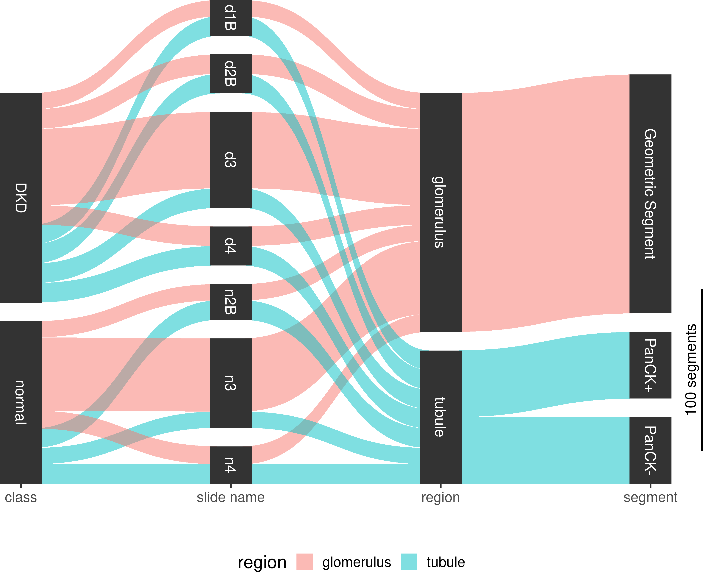

```{r setup, include=FALSE}
knitr::opts_chunk$set(
  message = FALSE,
  warning = FALSE,
  fig.width = 10,
  comment = "#>"
)
```


```{r include=FALSE}
# Setting Working Directory
setwd("~/hades/nyeshlur")
```

### Load Libraries
```{r Load Libraries}
library(NanoStringNCTools)
library(GeomxTools)
library(GeoMxWorkflows)
library(data.table)
library(plyr)
library(dplyr)
```

### Loading Data
The dataset used in this guide is a GeoMx kidney dataset created with the WTA assay. The gene expression data from this dataset will be used in machine learning models to illustrate binary classification of diabetic kidney disease (DKD) and normal samples.
```{r}
target_demoData <- readRDS("target_demoData.rds")
```

```{r echo = FALSE, fig.cap = "Sankey Diagram of Kidney Dataset"}
library(knitr)

```
## **Data Pre-processing**

### Subsetting target_demoData by region
```{r}
# subsetting target_demoData by region
glomerulus_region_subset <- 
  subset(target_demoData,
         select=pData(target_demoData)[["region"]]=="glomerulus")

tubule_region_subset <- 
  subset(target_demoData,
         select=pData(target_demoData)[["region"]]=="tubule")
```

### Count of DKD and normal samples in the Glomeruli
```{r}
table(glomerulus_region_subset$class)
```

### **Feature Selection**

### Coefficient of Variation
```{r}
# create a log2 transform of the data for analysis
assayDataElement(object = glomerulus_region_subset, elt = "log_q") <-
  assayDataApply(glomerulus_region_subset, 2, FUN = log, base = 2, elt = "q_norm")

# create CV function
calc_CV <- function(x) {sd(x) / mean(x)}
CV_dat <- assayDataApply(glomerulus_region_subset,
                         elt = "log_q", MARGIN = 1, calc_CV)
# show the highest CD genes and their CV values
CV_dat_ordered <- sort(CV_dat, decreasing = TRUE)[1:20]
CV_dat_ordered
```

```{r include = FALSE}
library(pheatmap)  # for pheatmap
# Identify genes in the top 3rd of the CV values
GOI <- names(CV_dat)[CV_dat > quantile(CV_dat, 0.8)]
pheatmap(assayDataElement(glomerulus_region_subset[GOI, ], elt = "log_q"),
         scale = "row", 
         show_rownames = FALSE, show_colnames = FALSE,
         border_color = NA,
         clustering_method = "average",
         clustering_distance_rows = "correlation",
         clustering_distance_cols = "correlation",
         breaks = seq(-3, 3, 0.05),
         color = colorRampPalette(c("purple3", "black", "yellow2"))(120),
         annotation_col = 
             pData(target_demoData)[, c("class", "segment", "region")])
```

```{r include=FALSE}
library(knitr)

# convert test variables to factors
pData(target_demoData)$testRegion <-
  factor(pData(target_demoData)$region, c("glomerulus", "tubule"))
pData(target_demoData)[["slide"]] <-
  factor(pData(target_demoData)[["slide name"]])
assayDataElement(object = target_demoData, elt = "log_q") <-
  assayDataApply(target_demoData, 2, FUN = log, base = 2, elt = "q_norm")

```

```{r include=FALSE}
# run LMM:
# formula follows conventions defined by the lme4 package
results <- c()
for(status in c("DKD", "normal")) {
  ind <- pData(target_demoData)$class == status
  mixedOutmc <-
    mixedModelDE(target_demoData[, ind],
                 elt = "log_q",
                 modelFormula = ~ testRegion + (1 + testRegion | slide),
                 groupVar = "testRegion",
                 nCores = parallel::detectCores(),
                 multiCore = FALSE)

  # format results as data.frame
  r_test <- do.call(rbind, mixedOutmc["lsmeans", ])
  tests <- rownames(r_test)
  r_test <- as.data.frame(r_test)
  r_test$Contrast <- tests

  # use lapply in case you have multiple levels of your test factor to
  # correctly associate gene name with it's row in the results table
  r_test$Gene <-
    unlist(lapply(colnames(mixedOutmc),
                  rep, nrow(mixedOutmc["lsmeans", ][[1]])))
  r_test$Subset <- status
  r_test$FDR <- p.adjust(r_test$`Pr(>|t|)`, method = "fdr")
  r_test <- r_test[, c("Gene", "Subset", "Contrast", "Estimate",
                       "Pr(>|t|)", "FDR")]
  results <- rbind(results, r_test)
}
```

### Differential Expression
```{r}
# convert test variables to factors
pData(target_demoData)$testClass <-
  factor(pData(target_demoData)$class, c("normal", "DKD"))
```

```{r}
# run LMM:
# formula follows conventions defined by the lme4 package
results2 <- c()
for(region in c("glomerulus", "tubule")) {
  ind <- pData(target_demoData)$region == region
  mixedOutmc <-
    mixedModelDE(target_demoData[, ind],
                 elt = "log_q",
                 modelFormula = ~ testClass + (1 | slide),
                 groupVar = "testClass",
                 nCores = parallel::detectCores(),
                 multiCore = FALSE)
  
  # format results as data.frame
  r_test <- do.call(rbind, mixedOutmc["lsmeans", ])
  tests <- rownames(r_test)
  r_test <- as.data.frame(r_test)
  r_test$Contrast <- tests
  
  # use lapply in case you have multiple levels of your test factor to
  # correctly associate gene name with it's row in the results table
  r_test$Gene <- 
    unlist(lapply(colnames(mixedOutmc),
                  rep, nrow(mixedOutmc["lsmeans", ][[1]])))
  r_test$Subset <- region
  r_test$FDR <- p.adjust(r_test$`Pr(>|t|)`, method = "fdr")
  r_test <- r_test[, c("Gene", "Subset", "Contrast", "Estimate", 
                       "Pr(>|t|)", "FDR")]
  results2 <- rbind(results2, r_test)
}
```

```{r}

results2_sorted <- results2[order(-abs(results2$Estimate)),]
results2_filtered <- results2_sorted[results2_sorted$FDR <= .05,]
results2_filtered <- results2_filtered[results2_filtered$Subset == "glomerulus",]

kable(results2_filtered[1:20,], digits = 10,
      caption = "DE results",
      align = "lc", row.names = FALSE)

```

### Subsetting GeoMxSet Object by genes of interest, as determined by DE
```{r}
DE_genes <- results2_filtered$Gene[1:20]
DE_subset <- subset(glomerulus_region_subset, TargetName %in% DE_genes)
```

### Subsetting GeoMxSet Object by genes of interest, as determined by CV
```{r}
CV_genes <- names(CV_dat_ordered)
CV_subset <- subset(glomerulus_region_subset, TargetName %in% CV_genes)
```

### **Data Splitting for Training and Testing of Models**

### Split Function
The splitgeomx function splits the GeoMxSet Object into two objects, one to be used for model training and one for model testing. Maintaining the split data as GeoMxSet Objects allows users to continue to be able to link experiment data with associated metadata. So each subset object contains the subset experiment data and all of the associated subset metadata.

```{r}
source("GeoMxSetSplit.R")

split_ratio <- 0.7
train_test_list <- splitgeomx(glomerulus_region_subset,split_ratio)
train_split <- train_test_list[[1]]
test_split <- train_test_list[[2]]
```

#### Dimensions of the original GeoMxSet Object, subset by region
```{r echo = FALSE}
dim(glomerulus_region_subset)
```

#### Dimensions of the GeoMxSet Object for training
```{r echo = FALSE}
dim(train_split)
```

#### Dimensions of the GeoMxSet Object for testing
```{r echo = FALSE}
dim(test_split)
```

### Dataset Builder Function
The datasetBuilder function takes the output split objects from the splitgeomx function and creates training and testing data frames. The function combines transposed expression data with the class used for classification. It also converts the feature type in the classification column into factors. The expression data consists of samples as rows and gene expression counts as columns.

```{r}
source("DatasetBuilder.R")
classifier_column <- "class" # For this dataset, the classification column is labeled as class
train_data <- datasetBuilder(exprs(train_split), pData(train_split)[[classifier_column]])
test_data <- datasetBuilder(exprs(test_split), pData(test_split)[[classifier_column]])
```

#### Dimensions of train_data
```{r echo = FALSE}
dim(train_data)
```

#### First 5 rows and first 10 columns of train_data
```{r echo = FALSE}
train_data[1:5,1:10]
```

#### Dimensions of test_data
```{r echo = FALSE}
dim(test_data)
```

#### First 5 rows and last 10 columns of test_data
```{r echo = FALSE}
test_data[1:5,10123:10132]
```

```{r}
source("MLFunctions.R")
```

## **Building Machine Learning Models**

### Mandatory Parameters for ML Function
#### 1. NanoStringGeoMxSet Object
#### 2. Classification Class Name
#### 3. Model Type

### Available Model Types
#### 1. Naive Bayes ("nb")
#### 2. K-Nearest Neighbor ("knn")
#### 3. Extreme Gradient Boosting (XGBoost) ("xgb")
#### 4. Random Forest ("rf")
#### 5. Support Vector Machine ("svm")


## Naive Bayes
```{r}
ml_function(glomerulus_region_subset,"class", "nb")
```

## K-Nearest Neighbor
```{r}
ml_function(glomerulus_region_subset,"class", "knn")
```

## XGBoost
```{r warning=FALSE}
ml_function(glomerulus_region_subset,"class", "xgb")
```

## Random Forest
```{r}
ml_function(glomerulus_region_subset, "class", "rf")
```

## Support Vector Machine
```{r}
ml_function(glomerulus_region_subset,"class", "svm")
```


## Session Information
```{r}
sessionInfo()
```

## Future Work

