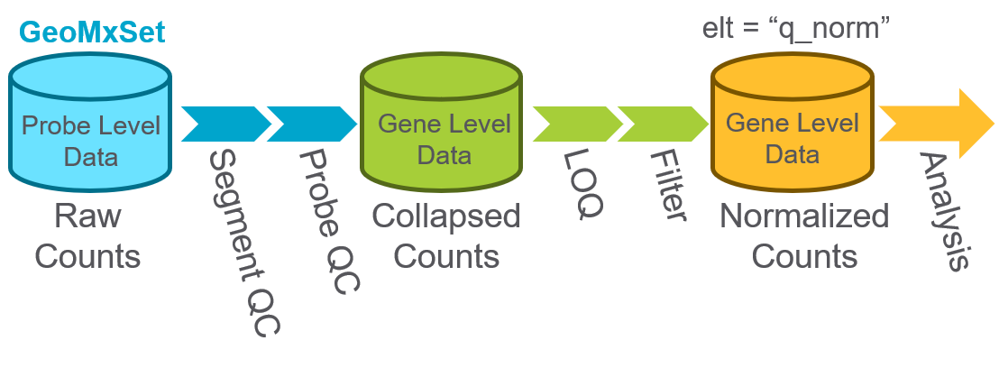
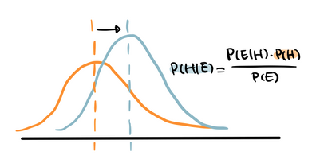
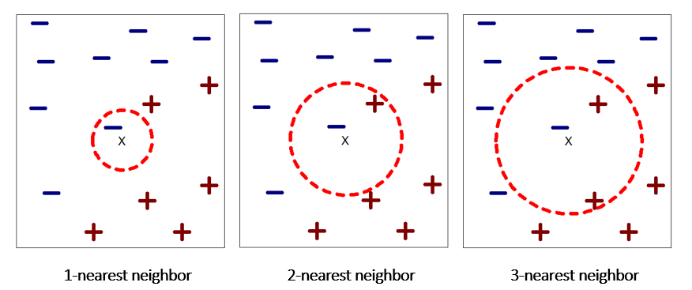
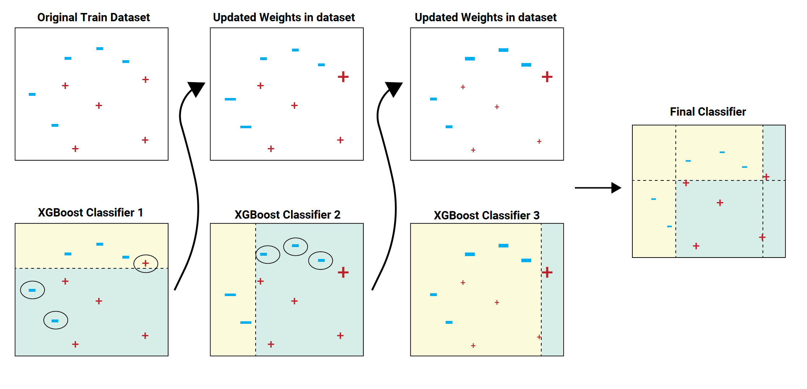
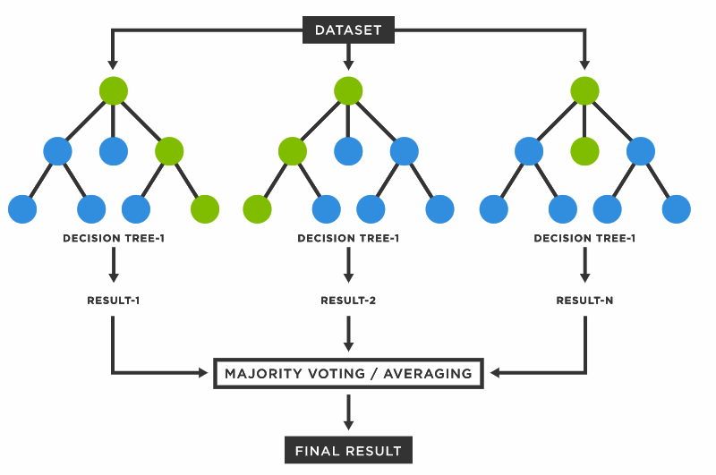

```{r setup, include=FALSE}
knitr::opts_chunk$set(
  message = FALSE,
  warning = FALSE,
  fig.width = 10,
  comment = "#>"
)
```


```{r include=FALSE}
# getwd() to get working directory
# setwd(dir)

# Setting Working Directory
setwd("~/hades/nyeshlur")
```

### Load Libraries
```{r Load Libraries}
library(NanoStringNCTools)
library(GeomxTools)
library(GeoMxWorkflows)
library(data.table)
```

### Overview
This vignette demonstrates the use of GeoMx gene expression data in machine learning models.

### Loading Data
The dataset used in this guide is a GeoMx kidney dataset created with the WTA assay. The gene expression data from this dataset will be used for supervised binary classification of diabetic kidney disease (DKD) and normal samples.
```{r}
target_demoData <- readRDS("target_demoData.rds")
```

```{r echo = FALSE, fig.cap = "Sankey Diagram of Kidney Dataset"}
library(knitr)
include_graphics("sankey.png")
```

## **Data Pre-processing**

```{r echo = FALSE, fig.cap = "The data has already undergone QC and Normalization."}

```

### Subsetting target_demoData by region
This dataset is subset by region to account for region-specific effects on gene expression. Going forward, the Glomerulus region subset will be utilized.
```{r}
# subsetting target_demoData by region
glomerulus_region_subset <- 
  subset(target_demoData,
         select=pData(target_demoData)[["region"]]=="glomerulus")

tubule_region_subset <- 
  subset(target_demoData,
         select=pData(target_demoData)[["region"]]=="tubule")
```

### Count of DKD and normal samples in the Glomeruli
```{r}
table(glomerulus_region_subset$class)
```

### **Feature Selection**

### Identifying Genes with High Coefficient of Variation
```{r cache=TRUE}
# create a log2 transform of the data for analysis
assayDataElement(object = glomerulus_region_subset, elt = "log_q") <-
  assayDataApply(glomerulus_region_subset, 2, FUN = log, base = 2, elt = "q_norm")

# create CV function
calc_CV <- function(x) {sd(x) / mean(x)}
CV_dat <- assayDataApply(glomerulus_region_subset,
                         elt = "log_q", MARGIN = 1, calc_CV)
# show the highest CD genes and their CV values
CV_dat_ordered <- sort(CV_dat, decreasing = TRUE)[1:20]
CV_dat_ordered
```

### Heatmap Showing Unsupervised Hierarchical Clustering of Genes with High CVs
```{r echo = FALSE, cache=TRUE}
library(pheatmap)  # for pheatmap
# Identify genes in the top 3rd of the CV values
GOI <- names(CV_dat)[CV_dat > quantile(CV_dat, 0.8)]
pheatmap(assayDataElement(glomerulus_region_subset[GOI, ], elt = "log_q"),
         scale = "row",
         show_rownames = FALSE, show_colnames = FALSE,
         border_color = NA,
         clustering_method = "average",
         clustering_distance_rows = "correlation",
         clustering_distance_cols = "correlation",
         breaks = seq(-3, 3, 0.05),
         color = colorRampPalette(c("purple3", "black", "yellow2"))(120),
         annotation_col =
             pData(target_demoData)[, c("class", "segment", "region")])
```

```{r include=FALSE, cache=TRUE}
library(knitr)

# convert test variables to factors
pData(target_demoData)$testRegion <-
  factor(pData(target_demoData)$region, c("glomerulus", "tubule"))
pData(target_demoData)[["slide"]] <-
  factor(pData(target_demoData)[["slide name"]])
assayDataElement(object = target_demoData, elt = "log_q") <-
  assayDataApply(target_demoData, 2, FUN = log, base = 2, elt = "q_norm")
```

```{r include=FALSE, cache=TRUE}
# run LMM:
# formula follows conventions defined by the lme4 package
results <- c()
for(status in c("DKD", "normal")) {
  ind <- pData(target_demoData)$class == status
  mixedOutmc <-
    mixedModelDE(target_demoData[, ind],
                 elt = "log_q",
                 modelFormula = ~ testRegion + (1 + testRegion | slide),
                 groupVar = "testRegion",
                 nCores = parallel::detectCores(),
                 multiCore = FALSE)

  # format results as data.frame
  r_test <- do.call(rbind, mixedOutmc["lsmeans", ])
  tests <- rownames(r_test)
  r_test <- as.data.frame(r_test)
  r_test$Contrast <- tests

  # use lapply in case you have multiple levels of your test factor to
  # correctly associate gene name with it's row in the results table
  r_test$Gene <-
    unlist(lapply(colnames(mixedOutmc),
                  rep, nrow(mixedOutmc["lsmeans", ][[1]])))
  r_test$Subset <- status
  r_test$FDR <- p.adjust(r_test$`Pr(>|t|)`, method = "fdr")
  r_test <- r_test[, c("Gene", "Subset", "Contrast", "Estimate",
                       "Pr(>|t|)", "FDR")]
  results <- rbind(results, r_test)
}
```

### Identifying Genes with Significant Differential Expression
```{r cache=TRUE}
# convert test variables to factors
pData(target_demoData)$testClass <-
  factor(pData(target_demoData)$class, c("normal", "DKD"))
```

```{r cache=TRUE}
# run LMM:
# formula follows conventions defined by the lme4 package
results2 <- c()
for(region in c("glomerulus", "tubule")) {
  ind <- pData(target_demoData)$region == region
  mixedOutmc <-
    mixedModelDE(target_demoData[, ind],
                 elt = "log_q",
                 modelFormula = ~ testClass + (1 | slide),
                 groupVar = "testClass",
                 nCores = parallel::detectCores(),
                 multiCore = FALSE)

  # format results as data.frame
  r_test <- do.call(rbind, mixedOutmc["lsmeans", ])
  tests <- rownames(r_test)
  r_test <- as.data.frame(r_test)
  r_test$Contrast <- tests

  # use lapply in case you have multiple levels of your test factor to
  # correctly associate gene name with it's row in the results table
  r_test$Gene <-
    unlist(lapply(colnames(mixedOutmc),
                  rep, nrow(mixedOutmc["lsmeans", ][[1]])))
  r_test$Subset <- region
  r_test$FDR <- p.adjust(r_test$`Pr(>|t|)`, method = "fdr")
  r_test <- r_test[, c("Gene", "Subset", "Contrast", "Estimate",
                       "Pr(>|t|)", "FDR")]
  results2 <- rbind(results2, r_test)
}
```

```{r cache=TRUE}
results2_sorted <- results2[order(-abs(results2$Estimate)),]
results2_filtered <- results2_sorted[results2_sorted$FDR <= .05,]
results2_filtered <- results2_filtered[results2_filtered$Subset == "glomerulus",]

kable(results2_filtered[1:20,], digits = 10,
      caption = "DE results",
      align = "lc", row.names = FALSE)
```

### Volcano Plot of Differential Expression Results
```{r echo=FALSE, cache=TRUE}
library(ggrepel)
# Categorize Results based on P-value & FDR for plotting
results2$Color <- "NS or FC < 0.5"
results2$Color[results2$`Pr(>|t|)` < 0.05] <- "P < 0.05"
results2$Color[results2$FDR < 0.05] <- "FDR < 0.05"
results2$Color[results2$FDR < 0.001] <- "FDR < 0.001"
results2$Color[abs(results2$Estimate) < 0.5] <- "NS or FC < 0.5"
results2$Color <- factor(results2$Color,
                        levels = c("NS or FC < 0.5", "P < 0.05",
                                   "FDR < 0.05", "FDR < 0.001"))

# pick top genes for either side of volcano to label
# order genes for convenience:
results2$invert_P <- (-log10(results2$`Pr(>|t|)`)) * sign(results2$Estimate)
top_g <- c()
for(cond in c("glomerulus", "tubule")) {
    ind <- results2$Subset == cond
    top_g <- c(top_g,
               results2[ind, 'Gene'][
                   order(results2[ind, 'invert_P'], decreasing = TRUE)[1:15]],
               results2[ind, 'Gene'][
                   order(results2[ind, 'invert_P'], decreasing = FALSE)[1:15]])
}
top_g <- unique(top_g)
results2 <- results2[, -1*ncol(results2)] # remove invert_P from matrix

# Graph results
ggplot(results2,
       aes(x = Estimate, y = -log10(`Pr(>|t|)`),
           color = Color, label = Gene)) +
    geom_vline(xintercept = c(0.5, -0.5), lty = "dashed") +
    geom_hline(yintercept = -log10(0.05), lty = "dashed") +
    geom_point() +
    labs(x = "Enriched in DKD <- log2(FC) -> Enriched in Normal",
         y = "Significance, -log10(P)",
         color = "Significance") +
    scale_color_manual(values = c(`FDR < 0.001` = "dodgerblue",
                                  `FDR < 0.05` = "lightblue",
                                  `P < 0.05` = "orange2",
                                  `NS or FC < 0.5` = "gray"),
                       guide = guide_legend(override.aes = list(size = 4))) +
    scale_y_continuous(expand = expansion(mult = c(0,0.05))) +
    geom_text_repel(data = subset(results2, Gene %in% top_g & FDR < 0.001),
                    size = 4, point.padding = 0.15, color = "black",
                    min.segment.length = .1, box.padding = .2, lwd = 2,
                    max.overlaps = 50) +
    theme_bw(base_size = 16) +
    theme(legend.position = "bottom") +
    facet_wrap(~Subset, scales = "free_y")
```


### Subsetting GeoMxSet Object by 20 genes of interest, as determined by DE
```{r}
DE_genes <- results2_filtered$Gene[1:20]
DE_subset <- subset(glomerulus_region_subset, TargetName %in% DE_genes)
```

### Subsetting GeoMxSet Object by 20 genes of interest, as determined by CV
```{r}
CV_genes <- names(CV_dat_ordered)
CV_subset <- subset(glomerulus_region_subset, TargetName %in% CV_genes)
```

### **Data Splitting for Training and Testing of Models**

### Split Function
The splitgeomx function splits the GeoMxSet Object into two objects, one to be used for model training and one for model testing. Maintaining the split data as GeoMxSet Objects allows users to continue to be able to link experiment data with associated metadata. So each subset object contains the subset experiment data and all of the associated subset metadata.

```{r}
source("GeoMxSetSplit.R")

# It is common for the training and testing dataset split ratio to be 70/30 or 80/20.
split_ratio <- 0.7

train_test_list <- splitgeomx(glomerulus_region_subset,split_ratio)
train_split <- train_test_list[[1]]
test_split <- train_test_list[[2]]
```

#### Dimensions of the original GeoMxSet Object, subset by region
```{r echo = FALSE}
dim(glomerulus_region_subset)
```

#### Dimensions of the GeoMxSet Object for training
```{r echo = FALSE}
dim(train_split)
```

#### Dimensions of the GeoMxSet Object for testing
```{r echo = FALSE}
dim(test_split)
```

### Dataset Builder Function
The datasetBuilder function takes the output split objects from the splitgeomx function and creates training and testing data frames. The function combines transposed expression data with the class used for classification. The expression data consists of samples as rows and gene expression counts as columns.

```{r}
source("DatasetBuilder.R")
classifier_column <- "class" # For this dataset, the classification column is labeled as class
train_data <- datasetBuilder(exprs(train_split), pData(train_split)[[classifier_column]])
test_data <- datasetBuilder(exprs(test_split), pData(test_split)[[classifier_column]])
```

#### Dimensions of train_data
```{r echo = FALSE}
dim(train_data)
```

#### First 5 rows and first 10 columns of train_data
```{r echo = FALSE}
train_data[1:5,1:10]
```

#### Dimensions of test_data
```{r echo = FALSE}
dim(test_data)
```

#### First 5 rows and last 10 columns of test_data
```{r echo = FALSE}
test_data[1:5,10123:10132]
```

## **Building Machine Learning Models**

### Input Parameters for ML Functions
#### 1. NanoStringGeoMxSet Object
#### 2. Classification Class
#### 3. Model Type
#### 4. Split Ratio (optional)
#### 5. Model Specific Parameters (optional)
##### a. Resampling Method (tuneLenght, trainControl, tuneGrid)
##### b. Seed

### Outputs for ML Functions
#### 1. Results of Parameter Tuning
#### 2. Most Important Variables
#### 3. Results of Testing Model

### Available Models
#### **1. Naive Bayes (nb)**
##### Naive Bayes Classifier is a probabilistic classifier that assumes conditional independence between features. This model assumes a Gaussian distribution of data.
##### Parameters: 
##### a. Laplace Correction (laplace)
##### b. Distribution Type (usekernel)
##### c. Bandwidth Adjustment (adjust)

```{r echo = FALSE}
library(knitr)

```

#### **2. K-Nearest Neighbor (knn)**
##### K-Nearest Neighbor Classifier is a non-parametric model that determines class membership (label) based on the most common label amongst k nearest neighbors.
##### Parameters: 
##### a. Neighbors (k)

```{r echo = FALSE}

```

#### **3. Extreme Gradient Boosting (XGBoost) (xgb)**
##### XGBoost Classifier is an optimized distributed gradient boosting model. The model uses additive training and boosted trees for optimization.
##### Parameters: 
##### a. Boosting Iterations (nrounds)
##### b. Max Tree Depth (max_depth)
##### c. Shrinkage (eta)
##### d. Minimum Loss Reduction (gamma)
##### e. Subsample Percentage (subsample)
##### f. Subsample Ratio of Columns (colsample_bytree)
##### g. Fraction of Trees Dropped (rate_drop)
##### h. Probability of Skipping Drop-out (skip_drop)
##### i. Minimum Sum of Instance Weight (min_child_weight)

```{r echo = FALSE}

```

#### **4. Random Forest (rf)**
##### Random Forest Classifier is an ensemble learning method. The outputs of many decision trees, which are trained on a random sampling of data, are aggregated to a single final decision.
##### Parameters: 
##### a. Starting Value of Number of Predictors Randomly Sampled at Each Split (mtryStart)
##### b. Number of Trees Used at The Tuning Step (ntreeTry)
##### c. Number By Which mtry is Changed at Every Iteration (stepFactor)
##### d. Required Improvement In OOB Error for Search to Continue (improve)
##### e. Print Progress of Search (plot)
##### f. Run Forest Using Optimal mtry Found (doBest)

```{r echo = FALSE}

```

#### **5. Support Vector Machine (svm)**
##### Support Vector Machine Classifier is a non-probabilistic binary linear model. SVM aims to classify data based on the position in relation to a border or hyperplance between the positive and negative class. The border is determined to maximize the distance between the classes.
##### Parameters: 
##### a. Cost (cost)
##### b. Loss Function (Loss)
##### c. Class Weight (weight)

```{r echo = FALSE}
include_graphics("svm3.png")
```

```{r}
source("MLFunctions.R")
```

## Naive Bayes
```{r}
ml_function(glomerulus_region_subset,"class", "nb")
```

## K-Nearest Neighbor
```{r}
ml_function(glomerulus_region_subset,"class", "knn")
```

## K-Nearest Neighbor with CV gene subset
```{r}
ml_function(CV_subset,"class", "knn")
```

## K-Nearest Neighbor with DE gene subset
```{r}
ml_function(DE_subset,"class", "knn")
```

## XGBoost
```{r warning=FALSE}
ml_function(glomerulus_region_subset,"class", "xgb")
```

## Random Forest
```{r}
ml_function(glomerulus_region_subset, "class", "rf")
```

## Random Forest with CV gene subset
```{r}
ml_function(CV_subset,"class", "rf")
```

## Random Forest with DE gene subset
```{r}
ml_function(DE_subset,"class", "rf")
```

## Support Vector Machine
```{r}
ml_function(glomerulus_region_subset,"class", "svm")
```

### Future Work
#### 1. Implement error handling and parameter checking in mlfunction.
#### 2. Implement cross validation function over entire dataset, without any splitting.
#### 3. Implement additional models, ex. logisitic regression.
#### 4. Perform user testing.
#### 5. Additional testing with more datasets.
#### 6. Explore machine learning applications of spatial data.
#### 7. Coercion to Python

### Session Information
```{r}
sessionInfo()
```